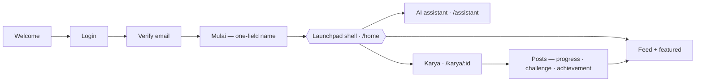
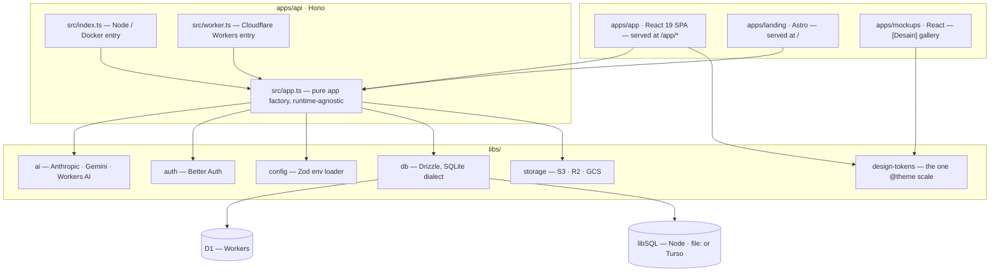
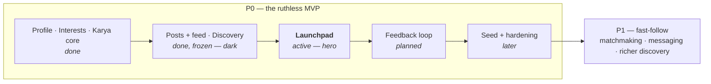

<div align="center">


# Al-Fath Berkarya

[](https://github.com/zakinadhif/buildersnetwork/actions/workflows/ci.yml)
[](LICENSE)
[](https://hono.dev)
[](https://react.dev)
[](https://workers.cloudflare.com)

**A community platform for builder students at Telkom University, built around the _karya_ — the work itself.**
**Members find their direction, build in the open, and find the people to build with.**

React 19 · Hono · Drizzle · SQLite (D1 / libSQL) · pluggable AI — one codebase, two deploy targets

[**Live demo**](https://buildersnetwork.web.id) · [Mockup gallery](https://mockups.buildersnetwork.web.id) · [Roadmap](plans/roadmap.md) · [Vision](plans/vision.md)

</div>

> **Status:** P0 — the ruthless MVP. One hero surface, **Launchpad**, finished to the edges. Matchmaking and messaging are demoted to P1 until real users validate the hero.

---

## 🎯 The problem

A campus is full of people building things, and almost none of them find each other. Projects live in private group chats, so a curious member can't tell what exists, what it's built with, or how to help — and asking means interrupting someone. Work that dies quietly wasn't bad work; it was work nobody could see or join.

## ✨ The solution

Make the **karya** the center of gravity. A project isn't a static listing — it's a living hub with visible contributors, a stream of progress/challenge/achievement updates, and a one-click way in. An AI onboarding chat turns "what are you into?" into a real profile without a form, and a feed keeps the community's momentum in front of everyone. The barrier to collaboration drops to near-zero: understand a project and find your way in without reading a wall of docs.

---

## 🧭 How it works



A newly-verified member enters straight into the **Launchpad shell** via a quick one-field start (`/mulai`) — onboarding is **no longer a gate**. The AI onboarding chat lives on as an always-available **assistant tab**; the older linear flow still works for anyone who opts into it.

From there, **karya** (projects) are the recurring surface. A member creates one — filling the draft directly, or letting the AI pre-fill it — and publishes a live karya page others can join. Approved members post short updates (`progress` / `challenge` / `achievement`) that surface both on the karya page and in an unranked **global feed**. That's the P0 core loop: *create karya → post → community responds → post again.*

📖 **Every screen, route, and the full loop: [plans/reference/user-flow.md](plans/reference/user-flow.md).**

---

## 🏗️ Architecture



The same codebase runs on both targets. The runtime entry — **not** an env var — picks the AI provider and the database client.

**The app and the mockups share one design scale.** `libs/design-tokens` holds the only `@theme` block in the repo — colour, type, spacing — and both frontends consume it; neither declares tokens of its own. They used to keep separate copies, which is how the app's typography quietly drifted off the mockups' scale. Where the two disagree, the mockup wins and the app conforms.

### Stack

| Layer | Technology |
|---|---|
| **Runtime** | Node.js 22 |
| **API** | Hono v4 |
| **Database ORM** | Drizzle ORM (SQLite dialect — D1 on Workers, libSQL on Node) |
| **Auth** | Better Auth (drizzle adapter, DB-backed sessions) |
| **AI** | Pluggable — Gemini API (Node/Docker), Anthropic API, or Cloudflare Workers AI |
| **Storage** | Pluggable — AWS S3, Cloudflare R2, GCS, MinIO |
| **Frontend** | React 19 + Vite + TailwindCSS v4 |
| **Routing** | Wouter (URL-based) |
| **Data Fetching** | TanStack Query v5 |
| **Monorepo** | pnpm workspaces |
| **Language** | TypeScript ~5.9 |

<details>
<summary><b>Project structure</b></summary>

<br>

```
buildersnetwork/
├── apps/
│   ├── api/               # Hono API server
│   │   ├── src/app.ts        # Pure Hono app factory (runtime-agnostic)
│   │   ├── src/index.ts      # Node.js / Docker entry (Gemini AI)
│   │   ├── src/worker.ts     # Cloudflare Workers entry (Workers AI)
│   │   └── src/routes/       # ai · karya · feed · members · interests · profile · otp · stats
│   ├── app/               # React SPA (served at /app/*)
│   ├── landing/           # Astro landing (served at /)
│   └── mockups/           # [Desain] gallery — static, no API/DB (mockups.buildersnetwork.web.id)
├── libs/
│   ├── ai/                # AI provider interface — Anthropic, Gemini, Workers AI adapters
│   │   └── src/react.ts      # useStream hook for frontend streaming
│   ├── api-spec/          # openapi.yaml — the source of truth for JSON endpoints
│   ├── api-client-react/  # generated: typed TanStack Query hooks
│   ├── api-zod/           # generated: Zod validators for every request/response
│   ├── auth/              # Better Auth config
│   ├── config/            # Zod-validated env loader
│   ├── db/                # Drizzle schema (SQLite) + libSQL (Node) / D1 (Workers) clients
│   ├── design-tokens/     # the ONE @theme scale — colour, type, spacing; app + mockups both consume it
│   ├── email/             # Resend / Cloudflare email senders
│   └── storage/           # S3-compatible / GCS storage adapters
└── deploy/
    ├── Dockerfile            # Single-container image (API + SPA + landing)
    ├── Dockerfile.api        # API-only image for 2-tier EC2 deployment
    ├── ansible/              # 2-tier EC2 deployment (api / web VMs; DB is a SQLite file)
    ├── docker-compose.dev.yml
    ├── docker-compose.selfhost.yml
    └── docs/                 # per-target deploy guides
```

</details>

---

## ⚡ Quick start

**Prerequisites:** Node.js >= 22 · pnpm >= 10 (`npm i -g pnpm`)

```bash
pnpm install

# Generate the API client + Zod validators from openapi.yaml.
# Required — the generated code is gitignored, so a fresh clone has none and the API won't boot.
pnpm codegen

# Copy and fill in env vars. You need three: APP_URL, DATABASE_URL, BETTER_AUTH_SECRET
# (min 32 chars — `openssl rand -base64 32`). Blank means unset, so leave the rest alone.
cp deploy/.env.example apps/api/.env

# Create the local SQLite DB (libs/db/local.db) and fill it with seed data
pnpm db:push
pnpm db:seed

# Start dev servers
pnpm dev:api   # Hono API on :8080
pnpm dev:app   # React SPA on :5173 — open this one
```

Sign in with any [seed account](#seed-accounts). Two optional extras: `docker compose -f deploy/docker-compose.dev.yml up -d` starts MinIO if you want image uploads (without it, the upload routes return 503 and nothing else changes), and `GEMINI_API_KEY` turns on the AI assistant.

> `DATABASE_URL` is resolved relative to `apps/api/`, while `pnpm db:push` writes to `libs/db/local.db`. The default — `file:../../libs/db/local.db` — points them at the same file. If they diverge, the API opens an empty database and the feed renders blank.

---

## 🔁 Adding an endpoint

**`libs/api-spec/openapi.yaml` is the source of truth for JSON endpoints.** Add the path there, run `pnpm codegen`, and you get typed TanStack Query hooks (`@myapp/api-client-react`) plus Zod validators (`@myapp/api-zod`) to parse the request with in your Hono route. The spec isn't documentation *of* the API — it *is* the API.

Two kinds of endpoint sit outside that contract on purpose, both because the generated client only speaks JSON: **AI streaming** (`POST /api/ai/stream` returns chunked plain text — read it with `useStream`, never the generated `aiStream`) and **binary upload/serve** (the karya cover and screenshot routes, hand-written, called via `apps/app/src/lib/upload.ts`). Everything else on `/api/ai`, including `POST /api/ai/complete`, is a normal generated JSON endpoint.

🔧 **The full workflow, and what to do for each of the three kinds: [plans/how-to/adding-an-endpoint.md](plans/how-to/adding-an-endpoint.md).**

---

## 📜 Scripts

The ones you'll actually use. `package.json` is the full list — including the `:watch` / `:ui` test variants and the Cloudflare build steps.

| Script | Description |
|---|---|
| `pnpm dev:api` · `dev:app` · `dev:landing` · `dev:mockups` | Start each app in watch mode |
| `pnpm codegen` | Regenerate React Query hooks + Zod validators from `openapi.yaml` |
| `pnpm better-auth:generate` | Regenerate `libs/db/src/schema/auth.ts` from auth config |
| `pnpm db:push` | Push Drizzle schema to a local SQLite file (local dev) |
| `pnpm db:generate` · `db:migrate` · `db:check` | Write / apply / verify migration files |
| `pnpm db:seed` | Run seeders against `DATABASE_URL` (see [Seed accounts](#seed-accounts)) |
| `pnpm db:studio` | Open Drizzle Studio |
| `pnpm lint` · `format` | Biome |
| `pnpm test:db` · `test:api` · `test:app` · `test:e2e` | Vitest units (db / API / SPA), Playwright e2e |
| `pnpm build:frontend` | Build SPA + landing (runs codegen first) |
| `pnpm cf:deploy` | Build everything and deploy to Cloudflare Workers |

### Seed accounts

`pnpm db:seed` creates five members with Better Auth `emailAndPassword` credentials, so you can sign in immediately in local dev or a preview environment:

| Email | Password |
|---|---|
| `hafiz@seed.local`, `fatimah@seed.local`, `rizal@seed.local`, `dinda@seed.local`, `arya@seed.local` | `seedpassword123` |

The password is not a secret — seed data is for local dev and previews only, and the seed runner refuses to run under `NODE_ENV=production` without `--force`. Re-running the seeder is idempotent.

---

## 🔑 Environment variables

**[`deploy/.env.example`](deploy/.env.example) is the full reference** — every variable, with the shapes each one accepts. Validated at startup by `@myapp/config`, so the app fails fast on a missing or invalid value. (`SERVE_STATIC` is the one exception: the Node entry reads it straight from `process.env`.)

The ones you need to boot:

| Variable | Description |
|---|---|
| `APP_URL` | Public origin the app is served from. Drives `BETTER_AUTH_URL` and `ALLOWED_ORIGINS` when those are unset |
| `DATABASE_URL` | libSQL URL (`file:` local SQLite, `libsql://` Turso). **Not used on Cloudflare** — the Worker binds a D1 database instead |
| `BETTER_AUTH_SECRET` | Secret for signing auth tokens (min 32 chars) |
| `GEMINI_API_KEY` | Required for Node.js / Docker — the AI provider is picked by the runtime entry, not this var |
| `RESEND_API_KEY` | The live email sender (the `[[send_email]]` binding needs Workers Paid and is dormant on the free tier) |
| `ADMIN_EMAILS` | Comma-separated allowlist of team emails who can feature karya (an allowlist, not RBAC) |
| `STORAGE_*` | S3-compatible object storage for the **Node/Docker** path — see [STORAGE_PROVIDERS.md](deploy/docs/STORAGE_PROVIDERS.md). On **Workers**, uploads use the native R2 binding `UPLOADS` instead. Absent storage → the cover/screenshot routes return 503 |

---

## 🚀 Deployment

**Two targets are live.** The same codebase, switched by the runtime entrypoint and env vars:

| Target | AI | Database | Static files | Guide |
|---|---|---|---|---|
| **Cloudflare Workers** — production | Workers AI (free) | D1 (SQLite binding) | Workers Assets | [DEPLOY_CLOUDFLARE.md](deploy/docs/DEPLOY_CLOUDFLARE.md) |
| **AWS EC2 2-tier (Ansible)** | Gemini API | SQLite file | nginx VM | [DEPLOY_EC2_ANSIBLE.md](deploy/docs/DEPLOY_EC2_ANSIBLE.md) |

`deploy/docs/` also carries starter-template guides for Fly, Railway, Render, Cloud Run, App Runner, Coolify, Compose and Vagrant. They're inherited from the stack this repo was built on and **nothing in CI exercises them** — treat them as unverified starting points, not supported targets.

### Local single-container

```bash
docker build -f deploy/Dockerfile -t buildersnetwork .
docker run --rm -p 8080:8080 --env-file deploy/.env buildersnetwork
```

### Cloudflare Workers

```bash
wrangler login
wrangler d1 create buildersnetwork                   # once — paste the database_id into wrangler.toml
wrangler r2 bucket create buildersnetwork-uploads    # once — the UPLOADS binding
wrangler secret put BETTER_AUTH_SECRET
wrangler secret put APP_URL
wrangler secret put RESEND_API_KEY   # the live email sender ([[send_email]] needs Workers Paid; dormant on free tier)
pnpm cf:deploy
```

The Worker reaches the database through the D1 binding (`env.DB`), so there is no `DATABASE_URL` secret. Migrations apply via `wrangler d1 migrations apply buildersnetwork --remote` (run by `release.yml`).

### EC2 2-tier (Ansible)

```bash
# 1. Build and transfer the API image to the backend EC2 VM
docker build -f deploy/Dockerfile.api -t buildersnetwork-api .

# 2. Build the frontend with the backend VM's address
VITE_API_URL=http://<BACKEND_IP>:8080 pnpm build:frontend

# 3. Fill in deploy/ansible/inventory.ini and group_vars/, then deploy
cd deploy/ansible
ansible-playbook -i inventory.ini playbooks/site.yml --ask-vault-pass
```

### PR previews

Every pull request **from a branch in this repo** gets a full ephemeral environment — its own D1 database (created, migrated, seeded), R2 bucket, and Worker — at `https://buildersnetwork-pr-<n>.<subdomain>.workers.dev`. A sticky comment posts the URL and the seed credentials; sign in with any [seed account](#seed-accounts). Concurrent previews are capped, and teardown reaps every resource when the PR closes.

Fork PRs get CI and the mockup preview, but no app preview — applying PR-authored migrations means running PR-authored code with database credentials. The reasoning, the credential setup, and the guard that stands between an account-wide token and production live in **[plans/how-to/preview-environments.md](plans/how-to/preview-environments.md)**.

PRs touching `apps/mockups/**` get a static gallery preview instead, and the public gallery ships to [mockups.buildersnetwork.web.id](https://mockups.buildersnetwork.web.id) — see **[plans/how-to/mockup-gallery.md](plans/how-to/mockup-gallery.md)**.

---

## 🗃️ Database

One SQLite dialect (`sqlite-core`) runs on all backends: **D1** on Cloudflare Workers, **libSQL** (a `file:` SQLite or a remote Turso database) on Node.

- **Schema**: `libs/db/src/schema/*.ts` — add a file per entity, re-export from `index.ts`
- **Auth schema**: auto-generated by `pnpm better-auth:generate` — treat as read-only output; put your own tables in `app.ts` and point FKs at the generated `users` table. The generated file is **committed**, so a fresh clone doesn't need to run it. Re-run it only when the Better Auth config changes, and follow it with `pnpm lint:fix` — the generator emits imports Biome then wants sorted
- **Local dev**: `pnpm db:push` syncs the schema straight to a local `file:` SQLite database
- **Production (Node)**: `pnpm db:generate` writes migration files to `libs/db/migrations/`; applied by `node dist/scripts/migrate.js` as a deploy step
- **Production (Cloudflare)**: the same migrations apply to D1 via `wrangler d1 migrations apply buildersnetwork --remote`

---

## 🎨 Design system

**The mockups are the north star.** Don't read the design system here — *look* at it, in the [mockup gallery](https://mockups.buildersnetwork.web.id) (`pnpm dev:mockups`). Its single source is **`apps/mockups/src/lib/tokens.ts`** (`T` — palette, type scale, spacing) with the shared chrome beside it in `apps/mockups/src/components/` (`Shell`, `Avatar`, `Tag`). **`apps/app/src/index.css` is the *port*** of those tokens into the shipping app as CSS custom properties.

Change a value in one of those two files, nowhere else — no doc restates them, so no doc can go stale against them. All UI copy is Bahasa Indonesia kasual.

---

## 🗺️ Roadmap



**The bet:** one hero surface, finished. Everything that pointed *forward* — matchmaking, messaging — moves to P1: not because it doesn't matter, but because building it before the hero is validated risks polishing concepts users haven't confirmed they want. Full detail, including what's explicitly out of scope, in [plans/roadmap.md](plans/roadmap.md).

---

## 🤝 Contributing

Team workflow (milestones → task issues → project board) is defined in [plans/how-to/build-workflow.md](plans/how-to/build-workflow.md); roadmap in [plans/roadmap.md](plans/roadmap.md). One-time setup beyond Quick start: `gh auth login`, then `gh auth refresh -s project,read:project`.

Claude Code users get the loop as repo skills:

| Skill | What it does |
|---|---|
| `/project-status` | Where we are — phase, milestone countdowns, board |
| `/pick-task` | Claim a task + load its full context |
| `/ship-task` | Open the PR + update the board |
| `/new-task` | File an issue *and* land it on the board |
| `/ratify` | Turn a decided `[Diskusi]` into docs + tasks |

---

## 📄 License

[MIT](LICENSE) © Zaki Nadhif
