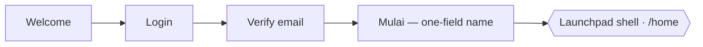

# User flow — the screens, and what a member walks through

*Reference. Domain objects: [content-model.md](content-model.md) · Capability IDs: [requirements.md](requirements.md) · Why any of it exists: [vision.md](../vision.md). Non-authoritative working knowledge — **trust the code when they diverge**; the routes below are read from [`apps/app/src/App.tsx`](../../apps/app/src/App.tsx).*

This is the *what a user does* altitude. [content-model.md](content-model.md) says what a post, a page, and a feed **are**; this doc says which screens a member actually passes through to reach them.

## The entry flow

**Onboarding is not a gate.** A newly-verified member lands on `/mulai`, the fast manual profile start, and can either enter the Launchpad shell directly or choose the recovered conversational AI path from the same screen. Every shell route redirects a profile-less member to `/mulai` — *not* to the AI chat (`App.tsx`).

The two gates that *do* exist:

- **Email verification.** A logged-in member without a verified email is redirected to `/verify-email` from anywhere (`App.tsx:44-47`).
- **Auth.** Any shell or detail route redirects a logged-out visitor to `/welcome`.

The optional conversational flow (`/onboarding` → `/review` → `/home`) is directly discoverable from `/mulai`. It saves an editable profile draft and returns to the P0 shell without generating or persisting match recommendations. Existing members can also use the always-available Asisten AI workspace (`/assistant`). Its user-owned conversations and messages persist on the server; the server reconstructs model context and streams typed AI SDK message parts. Profile and karya intakes finish through native draft tools, whose structured results are persisted and handed to the existing review surfaces. A member must still open and edit that draft before the existing profile-save or karya-publish flow can mutate product data.

## The routes

Wouter, base `/app` in production (`App.tsx:195`). `/` redirects by state — logged out → `/welcome`, no profile → `/mulai`, otherwise → `/home` — and anything unmatched redirects to `/`.

### Outside the shell — auth, entry, opt-in onboarding

| Route | Screen | Notes |
|---|---|---|
| `/welcome` | Welcome | The logged-out landing |
| `/login` | Login | |
| `/verify-email` | VerifyEmail | Hard gate; carries `?email=` |
| `/mulai` | MinimalStart | One-field start. Redirects to `/home` if a profile already exists |
| `/onboarding` | Onboarding | The opt-in AI chat flow |
| `/review` | Review | Review the AI-drafted profile |

### Inside the shell — the Launchpad rail

The persistent left-sidebar shell (`Shell` + rail, `apps/app/src/components/Shell.tsx`). `/home` also supplies the shell's **right column** (`LaunchpadRail`) — a generic per-route slot.

| Route | Screen | State |
|---|---|---|
| `/home` | Launchpad | **The hero.** Feed-first |
| `/minat` | Minat Saya | Live |
| `/assistant` | Assistant | Live — persisted conversation history, AI SDK streaming/tool parts, server-owned context, and editable profile/karya draft handoff |
| `/jelajahi` | *ComingSoon* | Placeholder — "segera hadir" |
| `/karya-saya` | *ComingSoon* | Placeholder — "segera hadir" |

Matchmaking is P1 and has no route or control in the P0 shell. Members can still browse and filter the ordinary People directory.

### Detail / creation — focused full-screen

Reachable from the shell, but not shell-hosted: their fixed-layout pages aren't wired into it yet (`App.tsx:134-135`).

| Route | Screen |
|---|---|
| `/member/:id` | Member profile |
| `/karya/new` | Create a karya — fill the draft directly |
| `/karya/new/ai` | Create a karya — let the AI pre-fill it |
| `/karya/:id` | The karya page |

## The core loop — karya → posts → feed

The recurring surface, reached from `/home`. This is the P0 core loop the roadmap is betting on: **create karya → post → community responds → post again.**

**A karya page** (`/karya/:id`) carries stage chips, interest tags, and a contributor roster shown as avatar faces. The owner can attach an icon-style cover and a Play Store-style **screenshot gallery** — landscape shots surface above the karya's row in the feed, portrait shots as a scroll-snap gallery on the detail page. Others request to join; the owner approves or declines.

**Posts are the event unit.** Approved members post short updates — `progress` / `challenge` / `achievement` — into a reverse-chron stream on the karya page; non-members see it read-only. Each update *also* surfaces in the **global feed**: a reverse-chronological, **unranked** interleave of recent posts and newly created karya. This dual read is the concrete shape of the rule in [content-model.md](content-model.md) — *the feed never contains pages, it contains events that point at pages*.

**`/home` is feed-first.** A hand-curated "Top picked inspiring projects" section sits atop the feed. Team members on the `ADMIN_EMAILS` allowlist see a ✦ toggle on each karya page to mark it featured — an **env allowlist, not a role system**, enforced server-side.

Backing tables (`libs/db/src/schema/app.ts`): `karya`, `karya_members`, `karya_interests`, `karya_screenshots`, `posts`, `featured`. Routes: `/api/karya` (list, create, detail, join, approve/decline, cover, screenshots), `/api/karya/:id/posts`, `/api/karya/:id/feature`, `/api/feed`, `/api/featured`.

## What's deliberately thin

Per the roadmap's [scope treatments](../how-to/build-workflow.md#scope-treatments--how-much-a-feature-gets-right-now), some of the above is **dark** — present and integrated, not invested in further until real users validate it:

- **Discovery** is done but frozen: search and filters exist and are thin. `/jelajahi` is the placeholder where fuller discovery will land, and that's **P1** — which is also why the discovery chat and members list no longer sit on `/home`.
- **Posts + feed** are built; the *feed display* is absorbed into Launchpad and polished there, while the **microblog posting** concept waits for validation.
- **Matchmaking and messaging** are P1 and have no active P0 route or control.
